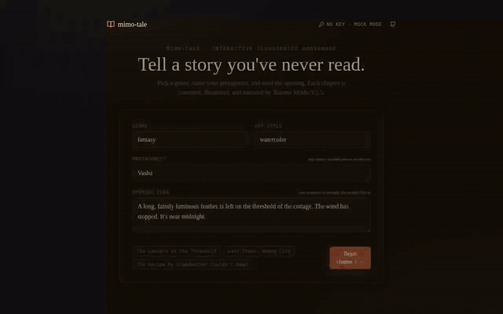

# mimo-tale

> **Interactive illustrated audiobook generator powered by Xiaomi MiMo V2.5.**
> Tell a story you've never read — every chapter is reasoned, illustrated,
> and narrated by the same MiMo key, behind a single OpenAI-compatible
> baseURL swap.

[](https://platform.xiaomimimo.com)


<p align="center">
  
</p>

> *24-second mock-mode playthrough of the 5-beat reference arc. Live mode swaps the SVG poster for a real `mimo-v2.5-vision` render and the silent track for `mimo-v2.5-tts` narration — same UI, same flow.*

---

## What it is

Most "AI story generators" stop at *a wall of text*. **mimo-tale** treats a
story as a **multimodal artefact**: every chapter is a real page of a real
book, with illustration and narration generated alongside the prose, and a
real fork at the end where you steer what happens next.

It is the smallest end-to-end app that exercises **all three pillars** of
the Xiaomi MiMo V2.5 family in a single user flow:

| Pillar | Used by | Per chapter |
| --- | --- | --- |
| **Reasoner** (`mimo-v2.5-reasoner`) | Storyteller | one tight scene + 3 branching choices, JSON-strict |
| **Multimodal** (`mimo-v2.5-vision`) | Illustrator | a 1024×1024 image of the scene |
| **TTS** (`mimo-v2.5-tts`) | Narrator | a 60–120 s narration mp3 |

```
                    ┌──────────────────┐
                    │   Storyteller    │  ◄── reasoner (JSON-strict)
                    │   chapter JSON   │
                    └────┬─────────┬───┘
                         │         │
            image_prompt │         │ text
                         ▼         ▼
                ┌──────────────┐  ┌──────────────┐
                │  Illustrator │  │   Narrator   │
                │  (multimodal)│  │     (TTS)    │
                │  → PNG/SVG   │  │  → MP3/WAV   │
                └──────────────┘  └──────────────┘
                         │         │
                         └────┬────┘
                              ▼
              browser ◄── chapter_done (SSE)
                  │
                  └─► user picks one of 3 branches
                                    │
                                    ▼
                            (loop, until is_ending)
```

---

## Quickstart

```bash
git clone https://github.com/0xnakamura/mimo-tale.git
cd mimo-tale
npm install
cp .env.example .env.local
# (optional) drop your MiMo key in MIMO_API_KEY=
npm run dev
# → http://localhost:3000
```

Or run **without a key** for an instant demo:

```bash
MIMO_FORCE_MOCK=1 npm run dev
```

Mock mode ships a deterministic 5-beat story arc with a poster-style SVG
illustration per chapter and a tiny silent WAV stand-in for narration —
useful for local dev, CI, and grant reviewers without a credential.

### Live mode

1. Sign in at [platform.xiaomimimo.com](https://platform.xiaomimimo.com).
2. Create an API key.
3. Either drop it in `.env.local`:
   ```bash
   MIMO_API_KEY=sk-...
   MIMO_BASE_URL=https://api.xiaomimimo.com/v1
   MIMO_REASONER_MODEL=mimo-v2.5-reasoner
   MIMO_VISION_MODEL=mimo-v2.5-vision
   MIMO_TTS_MODEL=mimo-v2.5-tts
   MIMO_TTS_VOICE=mimo-storyteller-warm
   ```
   …or paste it into the in-app **API Key** modal (top-right corner).

The MiMo platform is OpenAI-compatible, so the integration is a single-line
swap on the OpenAI SDK:

```ts
// lib/mimo.ts
return new OpenAI({
  apiKey,
  baseURL: "https://api.xiaomimimo.com/v1",
});
```

That same key also powers Claude Code, Cursor, and OpenClaw — which is how
this project was built end-to-end.

---

## How chapter generation works

Every chapter is a single SSE round-trip to `/api/chapter`. The orchestrator
fires the three agents in sequence (reasoner first, then illustrator and
narrator in parallel) and emits an event after every phase so the UI can
render progressively.

```
client                      /api/chapter                MiMo
  │                              │                        │
  │  POST { setup, history,      │                        │
  │         user_choice }        │                        │
  ├─────────────────────────────▶│                        │
  │                              │ chat.completions       │
  │                              │   (reasoner, JSON)     │
  │                              ├───────────────────────▶│
  │ ◄── chapter_start ──────────│                        │
  │ ◄── chapter_text ───────────│ ◄──── chapter JSON ────│
  │                              │                        │
  │                              │  ┌─ images.generate ──▶│
  │                              ├──┤                     │
  │                              │  └─ audio.speech ─────▶│
  │ ◄── image_ready ────────────│ ◄────── PNG b64 ───────│
  │ ◄── audio_ready ────────────│ ◄────── MP3 stream ────│
  │ ◄── chapter_done ───────────│                        │
```

If any of the three calls fails (model not provisioned, tier limit, etc.)
the orchestrator emits a non-fatal `error` event and falls through to the
deterministic mock for that asset. **The reader never sees a broken page.**

### Chapter contract

The Storyteller is locked to this JSON schema (zod-validated, with a
one-shot repair pass on `ValidationError`):

```ts
{
  index: number,           // chapter number, server-injected
  title: string,           // short evocative phrase, not a summary
  text: string,            // 110–220 words, one tight scene
  image_prompt: string,    // art-director-grade visual sentence
  branches: [string, string, string],  // 3 imperatives that diverge
  is_ending: boolean       // true when the model lands the arc
}
```

The model is allowed (and encouraged) to set `is_ending: true` from chapter
4 onward, at which point the three branches become epilogue flavours.

---

## Project structure

```
app/
  layout.tsx, page.tsx            App shell + main story page
  globals.css                     Book-paper palette + grain texture
  api/chapter/route.ts            SSE server route: reasoner + multimodal + TTS
components/
  StorySetup.tsx                  Genre / protagonist / opening / art-style form
  ChapterCard.tsx                 Image + text + audio + branches
  BranchPicker.tsx                3-way fork (or epilogue beats)
  AudioPlayer.tsx                 Custom <audio> with scrubbable progress
  ApiKeyDialog.tsx                Paste-your-key modal, browser-only storage
  ui/Button.tsx, Input.tsx        Primitives
lib/
  mimo.ts                         OpenAI client → platform.xiaomimimo.com
  schemas.ts                      Zod schemas + StreamEvent union
  storyteller.ts                  Reasoner agent (chapter JSON, JSON-strict)
  illustrator.ts                  Multimodal agent + SVG fallback
  narrator.ts                     TTS agent + silent-WAV fallback
  orchestrator.ts                 Per-chapter pipeline (server-side)
  runStory.ts                     Client-side SSE consumer
  mock.ts                         Deterministic 5-beat story for offline runs
  store.ts                        Zustand store, persisted to localStorage
```

---

## Why MiMo

* **One key, three pillars.** The reasoner, multimodal, and TTS endpoints
  share a single OpenAI-compatible client. No per-vendor adapters, no juggling
  three SDKs.
* **JSON-strict reasoning that stays in character.** The Storyteller agent
  emits a tight schema for hundreds of turns without drifting; that's what
  makes the branching loop feel authored rather than mashed together.
* **Voice that sells the page.** The TTS pillar is what turns this from a
  "story generator" into an audiobook — the narrator's tone is what readers
  remember.
* **Tooling-first ecosystem.** The same MiMo key that powers this app also
  powers Claude Code, Cursor, and OpenClaw — which is how `mimo-tale` was
  built end-to-end inside Windsurf / Cascade.

---

## Roadmap

- [ ] Per-character voices (TTS voice picker keyed off named characters)
- [ ] Save / share completed tales as a static page (image + audio + text)
- [ ] Reader history sidebar with one-click re-runs
- [ ] Audio crossfade between chapters for podcast-style consumption
- [ ] Multi-language tales (zh / id / ja / es) with localized presets
- [ ] Self-hosted MiMo deployment guide

---

## License

MIT — see [LICENSE](./LICENSE). `mimo-tale` is an independent open-source
project and is **not** affiliated with or endorsed by Xiaomi. "MiMo" is a
trademark of its respective owner; this project simply targets the MiMo
OpenAI-compatible API.
